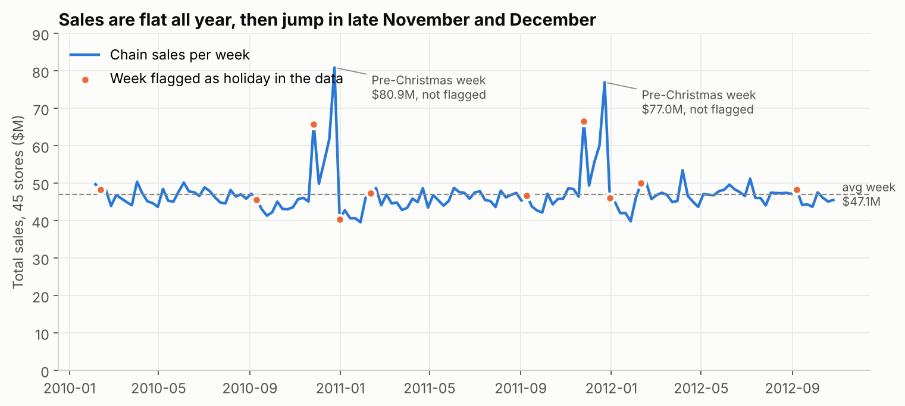
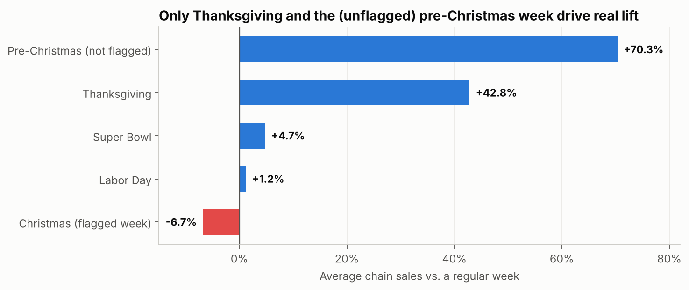
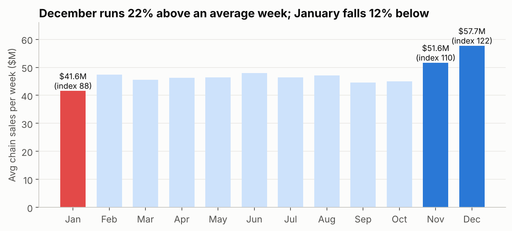
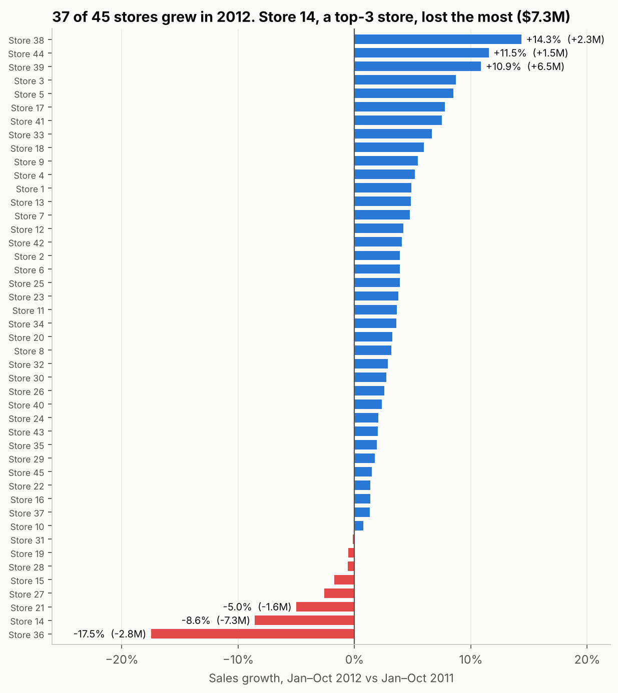
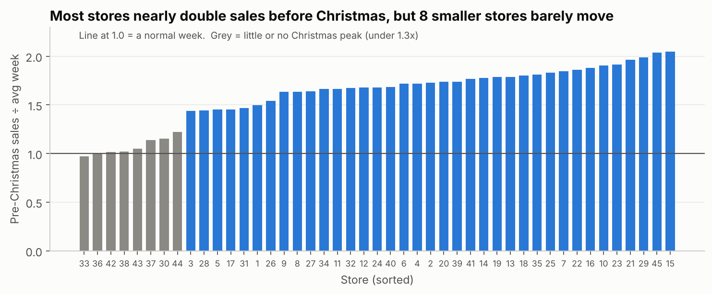
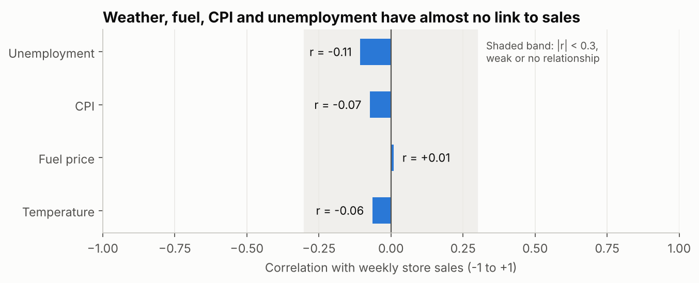
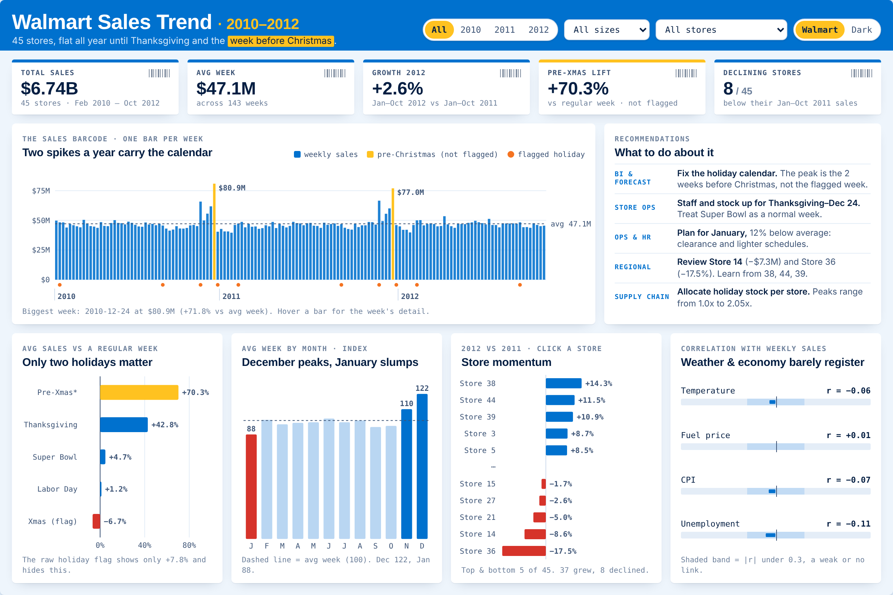
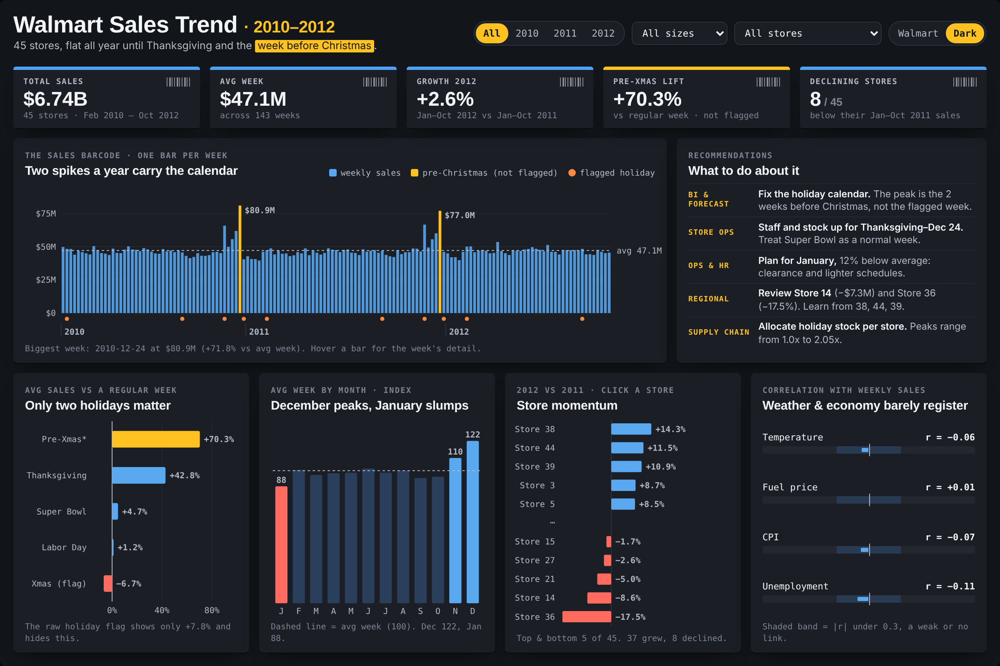

# Walmart Store Sales Analysis: Full Report

**Author:** Nishad Rashid Mahi · **Data period:** 5 Feb 2010 – 26 Oct 2012 · **Scope:** 45 stores, 143 weeks, 6,435 store-weeks

**Tools:** SQL (SQLite), Python (pandas, matplotlib), Excel, Tableau, HTML/JavaScript

---

## Contents

1. [Executive summary](#1-executive-summary)
2. [Business context and questions](#2-business-context-and-questions)
3. [Data](#3-data)
4. [Methodology](#4-methodology)
5. [Findings](#5-findings)
6. [Recommendations](#6-recommendations)
7. [Dashboard](#7-dashboard)
8. [Limitations](#8-limitations)
9. [Next steps](#9-next-steps)
10. [Appendix](#10-appendix)

---

## 1. Executive summary

Across 45 stores and almost three years, Walmart sold **$6.74B**, an average of **$47.1M per week** for the chain.
Sales are **flat for most of the year**. Like-for-like sales fell 0.6% in 2011 and rose 2.5% in 2012 (Feb–Oct),
so the useful questions are about *timing* and *store mix*, not overall growth.

**Five things matter most:**

1. **The most important week is mislabelled.** The week before Christmas averages **$79.0M, 70% above a regular week**,
   but the dataset doesn't flag it as a holiday. The week it *does* flag as Christmas sells **6.7% below** a normal week.
   A forecast built on the raw flag would under-forecast the pre-Christmas week by about **$29M** (see 5.1).
2. **Only two holidays drive real lift:** pre-Christmas (+70%) and Thanksgiving (+43%). Super Bowl (+5%) and Labor Day (+1%)
   are close to normal weeks.
3. **Seasonality is sharp at the ends of the year.** December runs at index 122 and November at 110, while January drops to 88.
4. **Store performance is concentrated and uneven.** The 12 largest stores generate 45% of sales. 37 of 45 stores grew in 2012,
   but **Store 14**, the #3 store by revenue, lost **$7.3M (−8.6%)**, about half of everything the 8 declining stores lost.
   Four of the 8 declining stores are large stores.
5. **External factors don't explain weekly sales.** Temperature, fuel price, CPI and unemployment all have correlations with
   weekly sales between −0.11 and +0.01.

**Recommended actions:** fix the holiday calendar, concentrate peak resources on Thanksgiving through Dec 24, plan for the
January slump, review Store 14 and Store 36, allocate holiday stock per store, and build forecasts on store history and the
calendar rather than macro inputs.

---

## 2. Business context and questions

A regional leadership team plans **inventory, staffing and promotions** for 45 stores. Getting the peak weeks wrong is
expensive in both directions: under-staffing and stock-outs in the busiest weeks, or excess labour and markdowns in quiet ones.

| # | Business question | Answered in |
|---|---|---|
| Q1 | How big is the business, and is it growing? | 5.3 |
| Q2 | Which holidays actually lift sales, and by how much? | 5.1, 5.2 |
| Q3 | How seasonal are sales across the year? | 5.3 |
| Q4 | Which stores drive revenue, and which are gaining or losing ground? | 5.4 |
| Q5 | Does the holiday peak look the same in every store? | 5.5 |
| Q6 | Do temperature, fuel price, CPI or unemployment drive sales? | 5.6 |

---

## 3. Data

**Source:** Walmart weekly sales dataset (Kaggle), file `Walmart.csv`.

| Column | Type | Description |
|---|---|---|
| `Store` | integer | Store number, 1–45 |
| `Date` | text, dd-mm-yyyy | Week-ending date (Friday) |
| `Weekly_Sales` | decimal | Store sales for the week, USD |
| `Holiday_Flag` | 0 / 1 | 1 if the week is marked as a holiday week |
| `Temperature` | decimal | Average temperature in the region, °F |
| `Fuel_Price` | decimal | Regional fuel price, USD per gallon |
| `CPI` | decimal | Consumer price index |
| `Unemployment` | decimal | Regional unemployment rate, % |

### Data quality

| Check | Result |
|---|---|
| Rows | 6,435 (45 stores × 143 weeks) |
| Missing values | 0 |
| Duplicate store-weeks | 0 |
| Stores with incomplete history | 0 |
| Zero or negative sales | 0 |
| Date format | **dd-mm-yyyy**. Parsing with the default US format silently swaps days and months, so dates are parsed explicitly. |
| Holiday flag | **Mislabels Christmas**: it flags the week ending Dec 31 rather than the week before Christmas (see 5.1) |

The data is clean and complete. The two issues that matter, the date format and the holiday labels, are both about
*meaning* rather than missing values. A quick sanity check wouldn't catch either.

### Derived fields

| Field | Definition |
|---|---|
| `Holiday_Event` | Names each flagged week (Super Bowl = Feb, Labor Day = Sep, Thanksgiving = Nov, Christmas = Dec). Weeks ending Dec 18–24 get their own label, **Pre-Christmas (not flagged)**. |
| `Size_Tier` | Stores grouped into four tiers by average weekly sales: 1 Large (12 stores), 2 Upper-mid (11), 3 Lower-mid (11), 4 Small (11) |
| `Store_Growth_2012_pct` | Store sales Jan–Oct 2012 ÷ Jan–Oct 2011 − 1 |
| `Store_Xmas_Multiplier` | Store's pre-Christmas week sales ÷ the store's own average week |

The cleaned file is `data/walmart_clean.csv`. The one-row-per-store summary is `data/store_summary.csv`.

---

## 4. Methodology

| Step | What was done | Where |
|---|---|---|
| 1. Validate | Row counts, nulls, duplicates, completeness, date parsing | `sql/01_create_and_clean.sql`, notebook §1 |
| 2. Engineer features | Holiday events, calendar fields, size tiers, store growth, Christmas multiplier | SQL `sales` view, notebook §2 |
| 3. Analyse | 10 SQL business queries using CTEs, window functions (`RANK`, `NTILE`, `LAG`, running `SUM OVER`) and Pearson correlation in pure SQL | `sql/02_business_questions.sql` → `sql/query_results.md` |
| 4. Cross-check | Every number recomputed independently in pandas and in Excel formulas. All three agree. | `notebooks/`, `excel/` |
| 5. Visualise | Six static charts for the report, a redesigned 1200×800 Tableau dashboard and an interactive web version | `images/`, `dashboard/` |

### Key definitions

* **Chain sales per week:** the sum of `Weekly_Sales` across the selected stores for one week.
* **Regular week:** any week that isn't a named holiday or the pre-Christmas week (131 of 143 weeks).
* **Lift:** average chain sales in the event weeks ÷ average chain sales in regular weeks − 1.
* **Like-for-like growth:** compares the *same months* in each year, because the data starts in Feb 2010 and ends in Oct 2012.
  Chain growth uses Feb–Oct. Store growth uses Jan–Oct 2012 vs Jan–Oct 2011.
* **Month index:** average chain sales per week in a month ÷ the overall average week × 100.
* **Correlation:** Pearson *r* between each factor and weekly store sales. It is computed across all store-weeks (pooled)
  and within each store over time (median of 45 per-store values).

---

## 5. Findings

### 5.1 The biggest week of the year is mislabelled



| Week ending | Chain sales | Flagged as holiday? | What it is |
|---|---|---|---|
| 2010-12-24 | **$80.9M** | No | Pre-Christmas |
| 2011-12-23 | **$77.0M** | No | Pre-Christmas |
| 2011-11-25 | $66.6M | Yes | Thanksgiving |
| 2010-11-26 | $65.8M | Yes | Thanksgiving |
| 2010-12-17 | $61.8M | No | Two weeks before Christmas |
| 2011-12-16 | $60.1M | No | Two weeks before Christmas |
| 2011-12-30 | $46.0M | **Yes** | Week *after* Christmas |
| 2010-12-31 | $40.4M | **Yes** | Week *after* Christmas |

The two biggest weeks in the dataset are not flagged as holidays. The week flagged as "Christmas" falls *after*
Christmas, when shoppers have already bought. Eight of the ten biggest weeks fall between Thanksgiving and Christmas,
and only the two Thanksgiving weeks among them carry the flag.

**Why it matters:** a planner who uses the raw flag sees a "holiday effect" of only **+7.8%** (holiday weeks vs non-holiday
weeks, per store). Applying that uplift to a regular week ($46.4M) forecasts about **$50.0M** for the pre-Christmas week.
The actual average was **$79.0M**, a gap of about **$29M** in a single week.
*(Illustrative calculation: it shows the size of the error, not the output of a production forecast.)*

### 5.2 Only two holidays move the needle



| Holiday week | Weeks in data | Avg chain sales | Lift vs regular week |
|---|---|---|---|
| Pre-Christmas *(not flagged)* | 2 | $79.0M | **+70.3%** |
| Thanksgiving / Black Friday | 2 | $66.2M | **+42.8%** |
| Super Bowl | 3 | $48.6M | +4.7% |
| Labor Day | 3 | $46.9M | +1.2% |
| Christmas *(flagged week)* | 2 | $43.2M | −6.7% |
| Regular week (baseline) | 131 | $46.4M | 0.0% |

Super Bowl and Labor Day behave almost like ordinary weeks. Treating all four flagged holidays as equal "holiday weeks"
blends two real peaks with two non-events and one below-normal week.

### 5.3 Flat year, sharp seasonal ends



| Month | Avg chain sales / week | Index (avg week = 100) |
|---|---|---|
| Jan | $41.6M | **88** |
| Feb | $47.4M | 101 |
| Mar | $45.6M | 97 |
| Apr | $46.2M | 98 |
| May | $46.4M | 99 |
| Jun | $47.9M | 102 |
| Jul | $46.4M | 99 |
| Aug | $47.2M | 100 |
| Sep | $44.5M | 94 |
| Oct | $45.0M | 95 |
| Nov | $51.6M | **110** |
| Dec | $57.7M | **122** |

* From February to October, every month sits between index 94 and 102.
* November and December together produced **20.4% of 2011 sales** in 9 of 52 weeks (17.3% of the weeks).
* January is the weakest month, at **12% below** an average week. It's a predictable post-holiday slump.
* **Growth:** like-for-like chain sales were −0.6% in 2011 and +2.5% in 2012 (Feb–Oct). Jan–Oct 2012 was up 2.6%
  (+$50.2M) on Jan–Oct 2011.

### 5.4 Store performance: concentrated revenue, uneven momentum



**Revenue concentration**

| Size tier | Stores | Avg weekly sales per store | Share of chain sales | Median growth 2012 |
|---|---|---|---|---|
| 1 Large | 12 | $1.77M | 45.1% | +3.6% |
| 2 Upper-mid | 11 | $1.18M | 27.5% | +3.6% |
| 3 Lower-mid | 11 | $0.76M | 17.7% | +2.3% |
| 4 Small | 11 | $0.42M | 9.8% | +5.5% |

The largest store (Store 20, $2.11M per week) sells about **8x** the smallest (Store 33, $0.26M per week).

**Top 10 stores by total sales**

| Rank | Store | Total sales | Avg week | Growth 2012 |
|---|---|---|---|---|
| 1 | 20 | $301.4M | $2.11M | +3.2% |
| 2 | 4 | $299.5M | $2.09M | +5.2% |
| 3 | **14** | $289.0M | $2.02M | **−8.6%** |
| 4 | 13 | $286.5M | $2.00M | +4.8% |
| 5 | 2 | $275.4M | $1.93M | +3.9% |
| 6 | 10 | $271.6M | $1.90M | +0.8% |
| 7 | 27 | $253.9M | $1.78M | −2.6% |
| 8 | 6 | $223.8M | $1.56M | +3.9% |
| 9 | 1 | $222.4M | $1.56M | +4.9% |
| 10 | 39 | $207.4M | $1.45M | +10.9% |

**Momentum (Jan–Oct 2012 vs Jan–Oct 2011)**

* **37 stores grew** and added $65.0M. **8 stores declined** and lost $14.8M, for a net gain of +$50.2M.
* **Store 14** lost **$7.3M (−8.6%)**, about half of all losses. Because it's the #3 store, a single-store problem shows
  up in chain totals.
* **Store 36** fell the fastest (**−17.5%**, −$2.8M).
* **4 of the 8 declining stores are large stores** (14, 27, 19, 31). Large-store softness deserves a closer look,
  because those stores carry 45% of revenue.
* **Fastest growth:** Store 38 (+14.3%), Store 44 (+11.5%) and Store 39 (+10.9%). Store 39 added the most dollars
  (+$6.5M).

| Declining store | Size tier | Jan–Oct 2011 | Jan–Oct 2012 | Change | Growth |
|---|---|---|---|---|---|
| 36 | Small | $16.1M | $13.3M | −$2.8M | −17.5% |
| 14 | Large | $84.7M | $77.4M | −$7.3M | −8.6% |
| 21 | Lower-mid | $31.8M | $30.3M | −$1.6M | −5.0% |
| 27 | Large | $73.9M | $71.9M | −$1.9M | −2.6% |
| 15 | Lower-mid | $25.3M | $24.8M | −$0.4M | −1.7% |
| 28 | Upper-mid | $55.7M | $55.3M | −$0.3M | −0.6% |
| 19 | Large | $59.5M | $59.2M | −$0.3M | −0.5% |
| 31 | Large | $60.0M | $59.9M | −$0.1M | −0.2% |

### 5.5 The holiday peak differs by store



* The median store sells **1.68x** its normal week in the pre-Christmas week. Stores 15, 45 and 29 sell over **2x**.
* **Eight stores barely peak (under 1.3x):** 33, 36, 42, 38, 43, 37, 30 and 44. Six of them are in the Small tier,
  where the median multiplier is just **1.22x**, compared with 1.68–1.81x in the other tiers.
* A single chain-wide holiday uplift would therefore **over-stock the small stores and under-stock the 2x stores**.

### 5.6 External factors don't explain weekly sales



| Factor | Correlation, all stores pooled | Median correlation within a store |
|---|---|---|
| Unemployment | −0.11 | −0.05 |
| CPI | −0.07 | +0.08 |
| Temperature | −0.06 | −0.13 |
| Fuel price | +0.01 | −0.00 |

No factor reaches |r| = 0.3, the usual threshold for even a weak relationship. CPI varies mainly *between regions*,
so any pooled "CPI effect" mostly reflects which stores are in which region. For weekly planning, **store identity and the
calendar explain far more than the macro-economy.**

---

## 6. Recommendations

| # | Recommendation | Evidence | Owner | Expected benefit |
|---|---|---|---|---|
| 1 | **Fix the holiday calendar** used in reporting and forecasting. Define the peak as Thanksgiving week and the 2 weeks before Christmas, and stop treating the week after Christmas as a holiday. | 5.1 | BI / Forecasting | Removes a forecast error of about $29M in the single biggest week |
| 2 | **Concentrate peak staffing, inventory and promotion budget on Thanksgiving through Dec 24.** Plan Super Bowl and Labor Day as normal weeks. | 5.2 | Store Ops, Merchandising | Budget moves to the weeks that actually deliver +43% to +70% |
| 3 | **Plan for the January slump:** clearance pricing, lighter staffing schedules, and use the quieter weeks for training and store resets. | 5.3 | Store Ops, HR | Lower labour cost in the weakest month (index 88) |
| 4 | **Review Store 14 and Store 36:** check local competition, out-of-stocks, staffing and customer service scores. Study **Stores 38, 44 and 39** for practices to copy, and monitor the 4 declining large stores. | 5.4 | Regional Management | Store 14 alone is a $7.3M gap against its prior year |
| 5 | **Allocate holiday inventory per store**, using each store's own peak multiplier (1.0x–2.05x) instead of one chain-wide uplift. | 5.5 | Supply Chain | Fewer markdowns in low-peak stores, fewer stock-outs in 2x stores |
| 6 | **Forecast from store history and calendar effects.** Leave temperature, fuel, CPI and unemployment out of weekly store forecasts. | 5.6 | Forecasting | Simpler models, with effort spent where the signal is |

---

## 7. Dashboard

An interactive 1200×800 dashboard summarises the analysis on one screen. It has two themes, Walmart colours and dark,
and you can filter it by year, store size and store. Clicking a store in **Store momentum** filters the whole page.

| Walmart theme | Dark theme |
|---|---|
|  |  |

* **Web version:** `dashboard/index.html` (open in a browser, or publish with GitHub Pages).
* **Tableau version:** [published on Tableau Public](https://public.tableau.com/app/profile/nishad.rashid.mahi/viz/WalmartSales_17286028604180/WalmartSalesTrend).
* **What changed from version 1:** see the [comparison in the README](README.md#what-i-improved-from-version-1).

**How the design supports the story:**

* KPI cards answer "how big / how fast / how peaky" before any chart.
* The "sales barcode" shows all 143 weeks, so both the flat year and the two spikes are visible at a glance.
* Colour carries meaning. Blue is ordinary data, Spark yellow appears **only** on the pre-Christmas peak, and red appears
  **only** on declines.
* Chart titles state the takeaway ("Only two holidays matter") rather than naming the chart.

---

## 8. Limitations

* **Short history:** 2.75 years, with only two complete holiday seasons (2010 and 2011). Holiday lift estimates rest on
  2–3 weeks each.
* **No product, department, margin, traffic or store-size data,** so the analysis shows *where* and *when* sales change
  but can't fully explain *why* (for example, why Store 14 is declining).
* **Correlation is not causation.** The weak macro correlations apply to weekly store sales in this period and region mix only.
* **Calendar alignment:** holidays fall on different dates each year. The pre-Christmas window (week ending Dec 18–24)
  is a fixed rule that matches both years in this data, but it should be checked against new data.
* **Revenue only:** growing sales don't necessarily mean growing profit.

---

## 9. Next steps

1. **Diagnose Store 14:** add department-level sales, staffing and local competitor openings.
2. **Forecasting model:** build a seasonal model (SARIMA or Prophet) with the corrected holiday calendar, and measure the
   accuracy gain over a model that uses the raw flag.
3. **Store clustering:** group stores by seasonality profile (peak multiplier, January dip) rather than by size alone,
   to drive allocation rules.
4. **Automate:** schedule the SQL and refresh the dashboard as new weeks arrive.

---

## 10. Appendix

### A. Repository map

| Path | Contents |
|---|---|
| `Walmart.csv` | Raw data |
| `data/walmart_clean.csv` | Cleaned data with derived fields (used by Tableau) |
| `data/store_summary.csv` | One row per store |
| `sql/01_create_and_clean.sql` | Schema, cleaning view, data-quality checks |
| `sql/02_business_questions.sql` | 10 business queries |
| `sql/query_results.md` | Output of every query |
| `notebooks/walmart_sales_analysis.ipynb` | Full Python analysis with outputs |
| `excel/Walmart_Store_Performance.xlsx` | Formula-driven manager summary |
| `dashboard/index.html` | Interactive 1200×800 dashboard, two themes |
| `Walmart Sales.twb`, `Project finalized.png` | Version 1 Tableau workbook and screenshot |
| `images/` | Charts and dashboard screenshots |

### B. SQL query index

| Query | Question | Techniques |
|---|---|---|
| Q1 | Headline KPIs | Aggregates, `COUNT(DISTINCT)` |
| Q2 | Like-for-like growth | CTE, `LAG()` |
| Q3 | Holiday lift | CTE, `CROSS JOIN` baseline |
| Q4 | Top 10 weeks vs holiday flag | `GROUP BY`, `ORDER BY … LIMIT` |
| Q5 | Seasonality index | CTE, scalar subquery |
| Q6 | Store league table and Pareto | `RANK()`, running `SUM() OVER` |
| Q7 | Store momentum | Conditional aggregation |
| Q8 | Size tiers | `NTILE(4)` |
| Q9 | Store holiday sensitivity | CTE, `JOIN … USING` |
| Q10 | External factor correlation | Pearson *r* from sums, `UNION ALL` |

### C. Reproduce

```bash
pip install pandas matplotlib openpyxl
python sql/run_sql.py               # SQL results  -> sql/query_results.md
python notebooks/build_notebook.py  # notebook, charts, data/*.csv
python excel/build_excel.py         # Excel workbook
python dashboard/build_dashboard.py # dashboard/index.html
```
